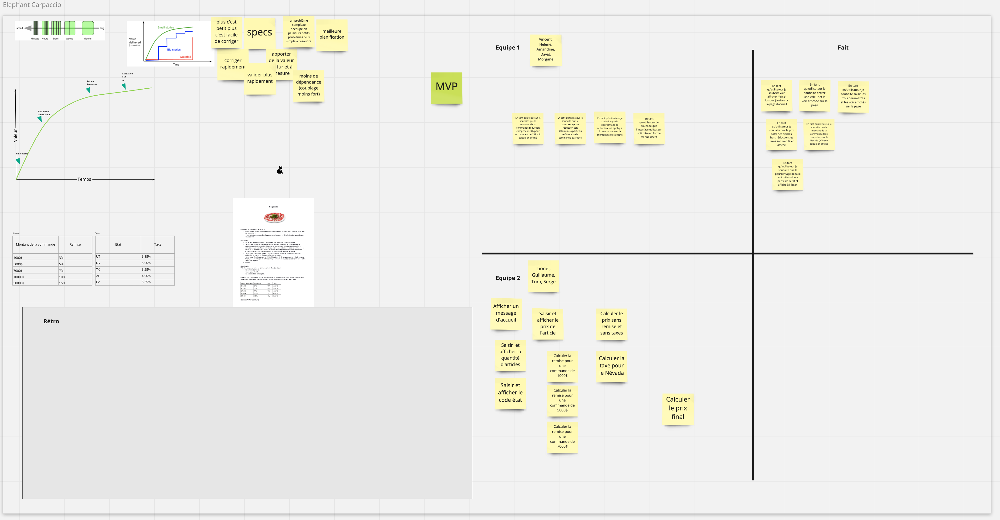

# 12/01/2021

Cet atelier est tiré de l'atelier créé par Alistair Cockburn (disponible [ici](https://alistair.cockburn.us/wp-content/uploads/2018/02/Elephant-Carpaccio-exercise-instructions.pdf) )
Cet atelier s'est fait en distanciel et tout le contenu de cette note part du principe que l'atelier se fait dans cette configuration.

Pour la mise en oeuvre en distanciel:
- via Teams | zoom | discord | meet…
  - avoir un salon de discussion principal
  - limiter la création de groupe à 2 (3 me semble compliqué)
  - demander aux équipes lors de leur constitution de créer un salon par équipe (le salon principal + un autre salon)
  - avec le distanciel on va perdre certaines informations (à moins d'avoir un système qui permette d'avoir le retour son des deux salons)
  - naviguez entre les 2 salons
- miro ou équivalent sur lequel
  - vous allez pouvoir partager les informations nécessaires à la tenue de l'atelier
  - les équipes vont pouvoir écrire leur backlog et faire la restitution en fin d'atelier

## But de l'atelier
Dans le cadre de l'équipe à qui j'ai proposé l'atelier, le but n'était pas d'apprendre aux participants comment rédiger des histoires mais de rappeler l'intérêt de réaliser des histoires finement découpées, apportant de la valeur à l'utilisateur ainsi que de prioriser son backlog.

## Déroulement
Le déroulement s'est fait en suivant cette [trame](https://www.occitech.fr/blog/2014/05/decoupez-vos-stories-en-carpaccio/) et avec cet [énoncé](https://www.occitech.fr/wp-content/uploads/2014/05/Carpaccio-FR.pdf)

### Pourquoi découpe-t-on les histoires?
- rappeler qu'une histoire est testable, démontrable et apporte de la valeur pour l'utilisateur
- demander aux participants de discuter entre eux de l'intérêt de faire un découpage:
  - Les réponses lors de l'atelier:
    - plus c'est petit plus c'est facile de corriger
    - specs
    - un problème complexe découpé en plusieurs petits problèmes plus simple à résoudre
    - meilleure planification
    - corriger rapidement
    - valider plus rapidement
    - apporter de la valeur au fur et à mesure
    - moins de dépendance (couplage moins fort)
  - Ajouter aux réponses les éléments suivants:
    - Apprendre plus vite
    - Livrer plus souvent
    - Des parties prenantes plus heureuses
    - Meilleure synchronisation des personnes et des équipes
    - Une meilleure privatisation
    - Un meilleur produit livré plus tôt
    - Plus d’options pour le business (cette partie est très importante et doit être rappelée lors de la rétro en fin d'atelier, en effet, offrir plus d'option pour le business permet d'actionner des leviers stratégiques ou développer une nouvelle stratégie (par exemple livrer en prod en ouvrant aux utilisateurs dès que l'on est capable de proposer la vente dans un état, prioriser l'ouverture dans un état plutôt qu'un autre…))
    - Moins de risque (moins de temps « sous l’eau »)
    - Plus de sens de la vélocité
- Dessiner les courbes de valeur pour la cascade, les grosses stories et les petites stories. Discutez. Pourquoi la courbe des "petites histoires" se termine avec une valeur cumulée plus élevée (boucle de retour plus courte, évolution du produit maitrisée, évolution du produit simplifiée)?

### Le produit
construire une application simple en 40 minutes, divisé en 5 itérations de 8 minutes.
Dans le cadre de cet atelier, nous avons annoncé la mise en place de 4 itérations de 8 minutes (afin de ne pas déborder sur le temps de l'atelier).
J'ai pris également la décision, lors de la 2de itération, d'annoncer une coupure budgétaire ne laissant la possibilité qu'à une ultime itération avec un nouvel objectif stratégique (cela peut-être, service disponible dans un état avec seulement 3 types de remise).

#### Énoncé
Nous allons développer un calcul de ventes. c’est une application avec une interface utilisateur, trois entrées et une sortie.
- Utilisez n’importe quel langage. L’interface peut être la console, la ligne de commande, le web, une interface graphique, des tests unitaires peu importe.
- Trois entrées :
  - Combien d’articles
  - Prix de chaque article
  - Code de l’État US de deux lettres
- Sortie:
  - Prix total de la commande.
  - Appliquer une réduction basée sur le montant total, puis ajouter la taxe fédérale correspondant au code de l’état et au prix réduit.

### Priorisation
Faire apparaître sur une courbe de valeur les différents jalons dans la vie de l'élaboration de notre produit:
- `5 états, 5 remises`, jalon se situant en haut de la courbe car toutes les valeurs métiers sont implémentées
- `Validation, UI "belle"`, jalon se situant au plus haut de la courbe après le jalon ci-dessus. L'idée est de montrer que cette partie peut-être travaillée ultérieurement, une fois que le métier est développé et déployé

### Création du backlog
- Répartissez les groupes:
  - insister sur le fait de mélanger les devs avec les PO, PM… (il y avait 9 participants, j'ai fait 2 groupes car dans le cadre d'un atelier distanciel, cela complique la tâche du facilitateur d'avoir plus de 2 groupes).
- Prêtez une attention particulière au vocabulaire utilisé par les équipes:
  - le but c'est de fournir de la valeur à l'utilisateur, les discussions techniques n'ont pas lieu d'être (et on ne sait même pas comment va être réalisé le produit)
  - est-ce que les histoires ont du sens?
- Backlog:
  - Ecrivez entre 10 et 20 histoires démontrables qui vous amènent de rien à 5 états et 5 remises.
  - Chacune d’entre elle doit être implémentable (interface comprise) en 2 à 6 minutes
  - Toutes les démos comportent de vraies entrées-sorties et sont notablement différentes de la dernière livraison.
- Quelle est votre première tranche ?
  - Tout ce qui est plus gros qu’un hello-word ou qu’un écho avec entrée/sortie est trop gros.
  Discutez de la valeur de la réduction du risque à implémenter et à livrer un hello-world comme première tranche. Valeur = valeur client + valeur de la connaissance acquise
  Discutez de la valeur de construire rapidement un squelette de l’application (tous les composants clé de l’architecture sont en place et connectés, nous avons donc un squelette qui marche). => observez bien lors de la phase de réalisation de la première histoire le temps mis par les équipes pour réaliser cette première histoire ainsi que les interrogations et réflexions qui émergent.
- Faire apparaître tout en bas de la courbe de valeur la première histoire `Hello World`
- Quelle est la prochaine histoire? (elle sera probablement trop grosse, demander à la redécouper).
  - la faire apparaître sur la courbe de valeur
- Une histoire va finir par émerger et proposer le `montant de la commande` (nb articles * prix article = montant de la commande). Faire apparaître sur la courbe de valeur cette histoire.
- Une histoire réalisant un MVP va émerger. Cela indique la possibilité de passage en prod et exposition du service aux utilisateurs (le MVP peut être nb articles * prix article + application de la taxe en UT => je peux vendre en Utah)
- Continuez à construire le backlog, l'affiner, le prioriser.
- Au final, il faut avoir entre 15 et 20 tranches

### Développement
Comme indiqué plus haut, j'ai annoncé la mise en place de 4 itérations de 8 minutes avec une coupure budgétaire avant la fin de la 2de itération.

Cette partie est intéressante car votre rôle de facilitateur / observateur va être très sollicité:
- Il faut prêter une attention particulière:
  - au comportement des équipes
  - aux réflexions / échanges qui ont lieu
  - aux sollicitations des équipes
  - à leur organisation
- le but de l'atelier n'est pas de tout réaliser mais de se rendre compte où nous mènent les décisions prises et de se confronter à des situations existantes dans un cadre réel.

Pour le déroulement de cette partie:
- Les équipes choisissent ce qu'elles veulent pour implémenter leur produit (excell, bash, console, junit => TDD): ne pas perdre de vue qu'il y a des non devs dans les équipes.
- Le chrono ne s'arrête jamais (ça enchaine comme dans la réalité)!
- Annoncer "Démo" quelques secondes avant la fin de la démo dans chaque salon
- quand une histoire est finie, l'équipe le notifie (dire Done/Slice, pinger le facilitateur, inviter le facilitateur dans le salon)
- Lancez le chrono, on ne s'arrête plus (bien garder en tête, noter où on se situe dans les itérations)

Durant vos passages dans les salons:
- prêtez attention à la réalisation:
  - si l'on déborde du cadre de l'histoire en cours => viré!
  - si l'on saute des étapes => viré!
- La première histoire `Hello World` est très révélatrice:
  - lors de l'élaboration du backlog, elle aura pu être perçue comme anodine, insignifiante, facile, ce n'est pas le cas:
    - le temps de choisir l'environnement "technique""
    - faire en sorte que cet environnement soit partagé par tout le monde (on est en distanciel!)
    - écrire le "Hello World"
    - les discussions (qu'est-ce que l'on fait? comment on le fait?…)
    - il s'est passé plusieurs minutes
  - correspond à la réalité d'un projet: bootstrap de l'application, déploiement, exécution
- Démo! (On a choisi l'organisation suivante: 1 personne de chaque équipe se rencontre dans un salon dédié. Une autre organisation peut être mise en place, un membre de l'équipe se rend dans le salon de l'autre équipe, le déroulement et les adaptations seront différentes de celles décrites ci-dessous):
  - branle-bas de combat:
    - il faut la mettre en place (création d'un salon supplémentaire où un membre de chaque équipe va présenter à l'autre)
    - pendant ce temps là, l'équipe continue de travailler sur l'application (la 2de itération vient de commencer!)
      - comment je construis mon incrément produit? (j'ai mon collègue qui démontre, je peux pas modifier pendant qu'il démontre)
- Itérations suivantes:
  - la personne qui a fait la démo revient, c'est déjà la fin de l'itération:
    - une autre personne démontre => OK
    - c'est la même personne qui démontre => observez

### Restitution
- Où en est-on dans l'élaboration du produit (où se situe-t-on sur la courbe de valeur)
- Est-ce que j'ai un MVP?
- Testez l'application
  - n'hésitez pas à utiliser des nombres qui vont générer un prix à plusieurs décimales (les résultats peuvent être différents d'une implémentation à l'autre => jouez la mauvaise foi un prix à 4 décimales n'est pas envisageable dans votre activité)
  - si vous avez invoqué une coupure budgétaire avec un changement de scope et le produit seulement disponible dans l'UTAH:
    - est-ce que mon produit est capable de le gérer? => si non, KO, je ne peux pas déployer mon produit
    - est-ce que mon produit peut faire des ventes dans un autre état? => si oui, KO, je n'ai pas les moyens d'honorer les ventes
  - le but n'est pas de jouer la mauvaise foi mais de montrer qu'un périmètre, une priorisation, la communication sont super importants dans la rédaction des histoires et dans leur réalisation

